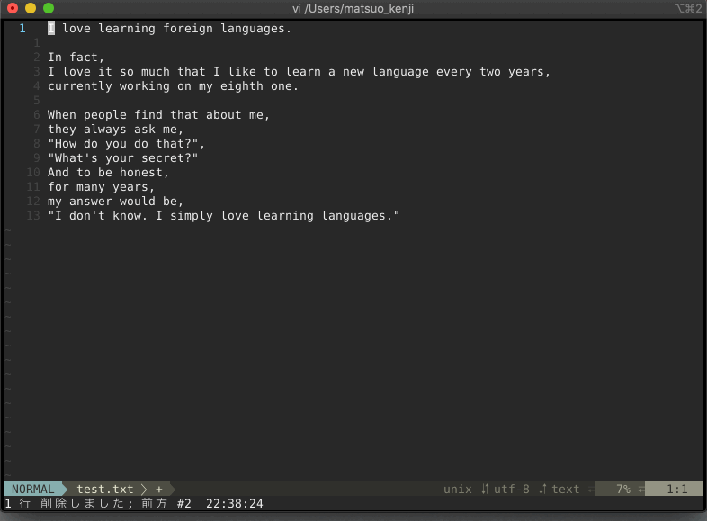

# translate.nvim

Translate between Japanese English and English Japanese

# Requirement
- curl
- neovim 0.4.0 or above

# Installtion

Please install using a plug-in manager or the like.

eg: dein.vim

```toml
[[plugins]]
repo = 'hotoolong/translate.nvim'
```

eg: Plugin

```vim
Plug 'hotoolong/translate.nvim'
```

# Usage

Converts Japanese to English and English to Japanese.

Translate current line
```vim
:Translate
```

Translate specified words
```vim
" result: こんにちは私の名前はホットウーロンです
:Translate hello my name is hotoolong
```
Reverse between resource and target to translate when using "!"
```vim
" result: It's a hotoolong
:Translate! ホットウーロンです
```

Translate selected lines
```vim
:'<,'>Translate
```
You can also set key mappings.

```vim
nmap gr <Plug>(Translate)
vmap t <Plug>(VTranslate)
```

# Demo



# Homage

https://github.com/skanehira/translate.vim

