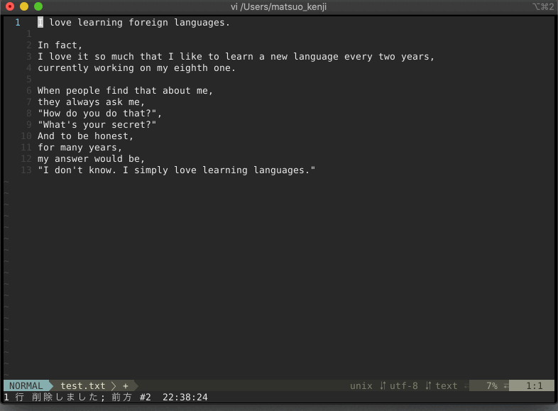

# translate.nvim

[](https://github.com/hotoolong/translate.nvim/actions/workflows/ci.yml)

Translate between Japanese English and English Japanese

# Requirement
- curl
- neovim 0.10.0 or above

# Installation

Please install using a plug-in manager or the like.

eg: dein.vim

```toml
[[plugins]]
repo = 'hotoolong/translate.nvim'
```

eg: Plugin

```vim
Plug 'hotoolong/translate.nvim'
```

# Version

Releases are tagged, so you can pin to one instead of following the default branch.

eg: dein.vim

```toml
[[plugins]]
repo = 'hotoolong/translate.nvim'
rev = 'v1.0.0'
```

eg: Plugin

```vim
Plug 'hotoolong/translate.nvim', { 'tag': 'v1.0.0' }
```

If your Neovim is older than 0.10.0, pin to `v0.1.0`. That is the last release of the
Vimscript implementation and it runs on Neovim 0.4.0 and later. Releases from `v1.0.0`
onward need 0.10.0 because they use `vim.system()`, `vim.json`, and `vim.health.start`.

# Usage

Converts Japanese to English and English to Japanese.

Translate current line
```vim
:Translate
```

Translate specified words
```vim
" result: こんにちは私の名前はホットウーロンです
:Translate hello my name is hotoolong
```

If there is anything other than English, it will be translated into Japanese.
```vim
" result: It's a hotoolong
:Translate ホットウーロンです
```

Translate selected lines
```vim
:'<,'>Translate
```
You can also set key mappings.

```vim
nmap gr <Plug>(Translate)
vmap t <Plug>(VTranslate)
```

# Option

To set the option to register the translation in the registry, do the following.

```vim
let g:translate_copy_result = 1
```

# Demo



# Homage

https://github.com/skanehira/translate.vim

